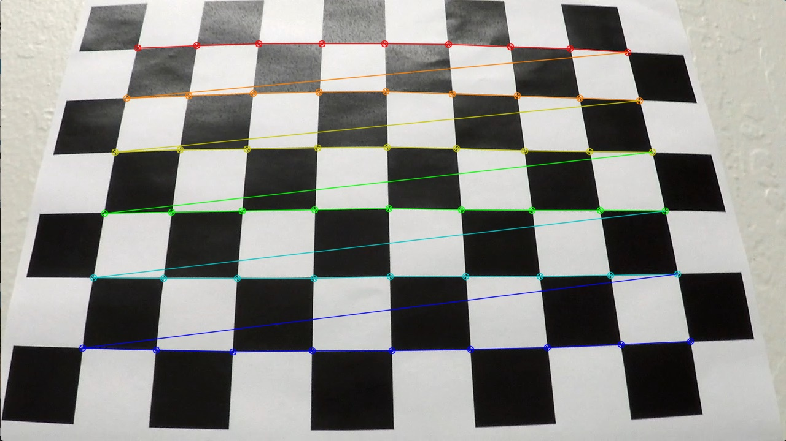
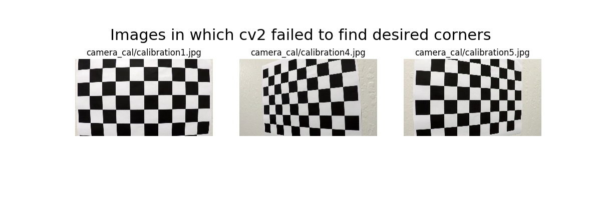
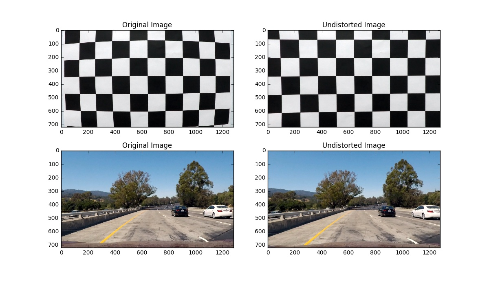

# Advanced Lane Lines
This Project is the fourth task of the Udacity Self-Driving Car Nanodegree program. The main goal of the project is to write a  software pipeline to identify the lane boundaries in a video from a front-facing camera on a car. Basically, it is an advinced version of the [Lane Line detection](https://github.com/NikolasEnt/LaneLine-project) project.

## Content of this repo

- `LaneLine.ipynb` Jupyter notebook with code for the project

## Camera Calibration

Implementation of the camera calibration process is based on build-in OpenCV functions.

### Measuring Distortion

To measure distortion of a camera it is possible to use photos of real world object with well-known shape. In the case, chessboard pattern was used.

OpenCV functions `findChessboardCorners()` and `drawChessboardCorners()` were used to automatically find and draw corners in an image of a chessboard pattern. "Object points", which will be the (x, y, z) coordinates of the chessboard corners in the real world were prepared  assuming the chessboard pattern is fixed on the (x, y) plane at z=0, such that the object points are the same for each calibration image. Thus, `objp` is just a replicated array of coordinates, and `objpoints` is appended with a copy of it every time `findChessboardCorners()` successfully detect all chessboard corners in a test image. `imgpoints` is appended with the (x, y) pixel position of each of the corners in the image plane with each successful chessboard pattern detection. It is expected to detect 9x6 grid of corners on the calibrated images.

Code of this step is in the first code cell of the Jupyter notebook. Example result of corner detection is depicted below:



Unfortunatly, the `findChessboardCorners()` failed to find desired corners on three images out of 20 provided calibration images, because there were not enought corners on these images due to framing. These frames were not used for distortion measuring.



### Computation of camera matrix and distortion coefficients

The output `objpoints` and `imgpoints` were used to compute the camera calibration and distortion coefficients using the `cv2.calibrateCamera()` function. It returns the camera matrix (`mtx`), distortion coefficients (`dist`), rotation and translation vectors, etc. For the code, see the second code cell of the project Jupyter notebook.

### Image undistortion
In the second code cell a function `undistort(img)` was also defined. This functions correct distortion of a given image using the `cv2.undistort()` function and previously computed camera matrix and distortion coefficients. Some sample results are shown below:




### Bird's Eye View transformation

Parallel lines appear to converge on images from the front facing camera due to perspective. In order to keep parallel lines parallel a bird's eye view transformation was applied. We shrink the bottom edge of an image to produce the same scale of the road to the top edge of the image. The way of transformation was selected because it preserves all avalable pixels from the raw image on the top edge where we have lower relative resolution. To find correct transformation source and destinations  points a test image with flat and straight road was used.

The following code computes the bird's eye view transformation matrix (`M`) as well as the matrix for inverse transformation (`Minv`). 

```Python

def create_M():
    src = np.float32([[0, 673], [1207, 673], [0, 450], [1280, 450]])
    dst = np.float32([[569, 223], [711, 223], [0, 0], [1280, 0]])
    M = cv2.getPerspectiveTransform(src, dst)
    Minv = cv2.getPerspectiveTransform(dst, src)
    return M, Minv

```

